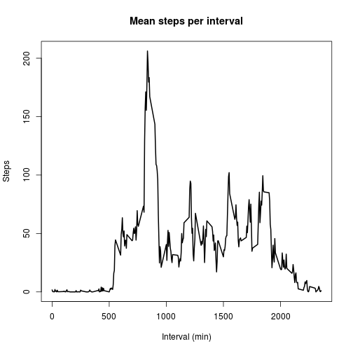

# Reproducible Research: Peer Assessment 1 report

*The following report shows the analysis of personal movement activity patterns using an activity monitoring device. This device collected data at 5-minute intervals through out the day. The collected data inludes two months of measurements collected during October and November of 2012. It includes the number of steps taken in 5-minute intervals each day, along with the date of the measurement.*

*An analysis was carried out, exploring the total amount of steps per day, average number of steps, and differences between measurments collected during the week or at the weekends, among others.*

## Loading and preprocessing the data

For loading and processing the data, one should setup the working directory for the R session in the same folder where the raw data is located.

After this the file is unzipped and read, using the following code:


```r
unzip("activity.zip")
#Reading of data
activity <- read.csv("activity.csv")
```

## What is mean total number of steps taken per day?

For answering this question three data are needed:

**1. Calculate the total number of steps taken per day**

To obtain the number of steps per day, the data must be aggregated, ie. sum, without having to deal with NA, using aggregate, by day


```r
StepsDay <- aggregate(steps ~ date, data = activity, FUN = sum, na.rm=TRUE)
```

After this aggregation the total number of steps taken by day are depicted here:


```r
StepsDay
```

```
         date steps
1  2012-10-02   126
2  2012-10-03 11352
3  2012-10-04 12116
4  2012-10-05 13294
5  2012-10-06 15420
6  2012-10-07 11015
7  2012-10-09 12811
8  2012-10-10  9900
9  2012-10-11 10304
10 2012-10-12 17382
11 2012-10-13 12426
12 2012-10-14 15098
13 2012-10-15 10139
14 2012-10-16 15084
15 2012-10-17 13452
16 2012-10-18 10056
17 2012-10-19 11829
18 2012-10-20 10395
19 2012-10-21  8821
20 2012-10-22 13460
21 2012-10-23  8918
22 2012-10-24  8355
23 2012-10-25  2492
24 2012-10-26  6778
25 2012-10-27 10119
26 2012-10-28 11458
27 2012-10-29  5018
28 2012-10-30  9819
29 2012-10-31 15414
30 2012-11-02 10600
31 2012-11-03 10571
32 2012-11-05 10439
33 2012-11-06  8334
34 2012-11-07 12883
35 2012-11-08  3219
36 2012-11-11 12608
37 2012-11-12 10765
38 2012-11-13  7336
39 2012-11-15    41
40 2012-11-16  5441
41 2012-11-17 14339
42 2012-11-18 15110
43 2012-11-19  8841
44 2012-11-20  4472
45 2012-11-21 12787
46 2012-11-22 20427
47 2012-11-23 21194
48 2012-11-24 14478
49 2012-11-25 11834
50 2012-11-26 11162
51 2012-11-27 13646
52 2012-11-28 10183
53 2012-11-29  7047
```

**2. Make a histogram of the total number of steps taken each day**

To see the distribution/frecuency of steps per day a histogram is plotted:


```r
hist(StepsDay$steps, xlab="Steps", main="Frecuency of steps", col="grey47", border="white")
```

 

**3. Calculate and report the mean and median of the total number of steps taken per day**

For this the mean and median are obtained:

Mean:

```r
mean(StepsDay$steps)
```

```
## [1] 10766.19
```
Median:

```r
median(StepsDay$steps)
```

```
## [1] 10765
```

## What is the average daily activity pattern?

In order to see how's the daily activity pattern, two steps are needed.

**1. A time series plot of the 5-minute interval and the average number of steps taken, averaged across all days.**

For this the first step is to aggregate the data by interval and calculate the mean of steps per interval.


```r
StepsInterval <- aggregate(steps ~ interval, data = activity, FUN = mean, na.rm=TRUE)
```

After this a time-series graph with the mean steps per interval can be made.


```r
plot(StepsInterval, type="l", xlab="Interval (min)", ylab="Steps", main="Mean steps per interval", lwd=2)
```

 

**2. Which 5-minute interval, on average across all the days in the dataset, contains the maximum number of steps?**

For this the maximum mean number of steps is found and the interval is reported.


```r
StepsInterval[StepsInterval$steps == max(StepsInterval$steps),]
```

```
##     interval    steps
## 104      835 206.1698
```
Being the interval **835** the one with highest number of steps.


## Imputing missing values

After a brief view of the original RAW data, it is noted that there are a some days/intervals in which there are missing values. This may be a source of bias in the calculations. To test for bias and to complement the report, the total number of NAs are to be reported and a strategy will be generated to impute the missing values with the mean of the corresponding 5-minute interval.

**1. Calculate and report the total number of missing values in the dataset.**

The total missing values, NAs are reported.


```r
sum(is.na(activity$steps))
```

```
## [1] 2304
```

**2. Imputaton of missing values in the dataset.** 

For this a replacement of the missing values with the average of each 5 minute interval was carried out, and a new dataset was created with the imputated values.


```r
nActivity <- activity
for (i in 1:nrow(nActivity)) {
  if (is.na(nActivity$steps[i])) {
    nActivity$steps[i] <- StepsInterval[which(nActivity$interval[i] == StepsInterval$interval), ]$steps
  }
}
```

**3. Generate a histogram of the total number of steps taken each day.**

A histogram is created with the new dataset. For this as before, first the data is aggregated by day.


```r
StepsDayN <- aggregate(steps ~ date, data = nActivity, FUN = sum, na.rm=TRUE)
```

And then the histogram of steps per day is generated


```r
hist(StepsDayN$steps, xlab="Steps", main="Frecuency of steps", col="grey47", border="white")
```

 

**4. Calculate and report the mean and median total number of steps taken per day.**

For this the mean and median are obtained:

Mean:

```r
mean(StepsDayN$steps)
```

```
## [1] 10766.19
```
Median:

```r
median(StepsDayN$steps)
```

```
## [1] 10766.19
```

**5. Do these values differ from the estimates from the first part of the assignment? What is the impact of imputing missing data on the estimates of the total daily number of steps?**

After calculating the mean and median, there does not seems to be a difference of the values, the means are equal ~1766 steps and the median is one step lower in the data with the missing values. Furthermore, by comparing the histograms it can also be seen that the data distributes in the same manner, only the data with the imputed values has a higher frecuency where the median/mean is located, thus avoiding any skewing of the data.

In summary, in this case the there was not a big impact by imputing the values, which maybe critical in other datasets.


## Are there differences in activity patterns between weekdays and weekends?

In order to see if there's a difference in the activity patterns depending if it is a weekday or during the weekend, the day of the week in which the measurments were done was obtained, and then compared between weekdays and weekend, using the dataset with imputed NAs.

**1. Create a new factor variable in the dataset with two levels – “weekday” and “weekend” indicating whether a given date is a weekday or weekend day.**

For this the data was first divided into week days and weekend


```r
nac <- nActivity
#Change class of dates
nac$Day <- weekdays(as.Date(nActivity$date))
#Replace days by weekday or weekend
nac$Day[nac$Day == "Monday"] <- "Weekday"
nac$Day[nac$Day == "Tuesday"] <- "Weekday"
nac$Day[nac$Day == "Wednesday"] <- "Weekday"
nac$Day[nac$Day == "Thursday"] <- "Weekday"
nac$Day[nac$Day == "Friday"] <- "Weekday"
nac$Day[nac$Day == "Saturday"] <- "Weekend"
nac$Day[nac$Day == "Sunday"] <- "Weekend"
```

Then the data is splitted between *weekday* or *weekend* and each one aggregated by interval


```r
InterWeek <- nac[which(nac$Day=="Weekday"),]
InterEnd <- nac[which(nac$Day=="Weekend"),]
#Then data is aggregated
InterWeek2 <- aggregate(steps ~ interval, data = InterWeek, FUN = mean, na.rm=TRUE)
InterEnd2 <- aggregate(steps ~ interval, data = InterEnd, FUN = mean, na.rm=TRUE)
#A tag is added to each dataset to know to which day it belongs
InterWeek2$Day <- "Weekday"
InterEnd2$Day <- "Weekend"
#Finally the data is re-grouped
medias <- rbind(InterWeek2, InterEnd2)
```

**2. A panel plot containing a time series plot of the 5-minute interval and the average number of steps taken, averaged across all weekday days or weekend days is generated using ggplot2.**


```r
library(ggplot2)
colors <- c("#E69F00", "#56B4E9")
ggplot(medias, aes(x=interval, y=steps, color=Day)) + facet_grid(Day ~ .) + 
  geom_line(size=1) + scale_colour_manual(values=colors) + 
  ylab(expression("Average steps per day")) + xlab("Interval (min)") + 
  ggtitle(expression("Steps per day according to day of the week")) + theme_bw() + theme(legend.position="bottom")
```

 

As seen by the plot, there seems to be a higher number of steps during early intervals during the week compared to the weekend. However, during the rest of the day there seems to be more activity in the intervals after the big peak of the weekday interval ~835 during the weekend. In summary, it seems to be the case that there are differences in the activity patterns between weekdays and weekends.
